# Contacts

A flutter project with Implementation of a Contacts app in 4 ways (API, Custom, Preferences and Sqflite).
It consist some common operations like create, edit , search and view operations on Contacts.
Contacts in this project are not linked with the contacts stored in your Smart phone.

* [App in Action In 4 Ways(API, Custom, Preferences and Sqflite)](https://youtu.be/yj1XKuq9TIQ)

## App Demonstrating the use of Flutter and PHP.

* App Logo Created Using [Material Design Icons](https://materialdesignicons.com/)
* For Hosting used [bingedev](https://bingedev.com/)

## Built With

* [Flutter](https://flutter.io) - Cross Platform App Development Framework

## Screenshots

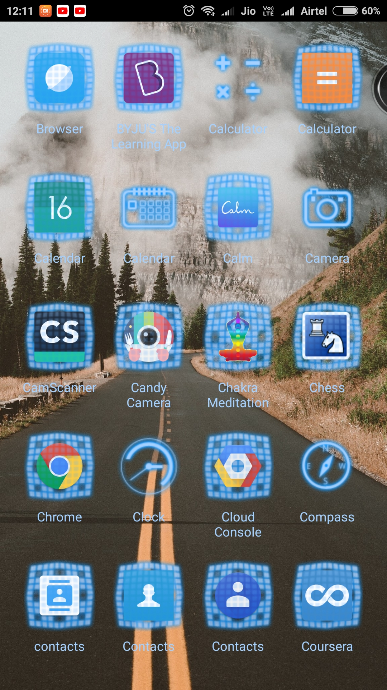
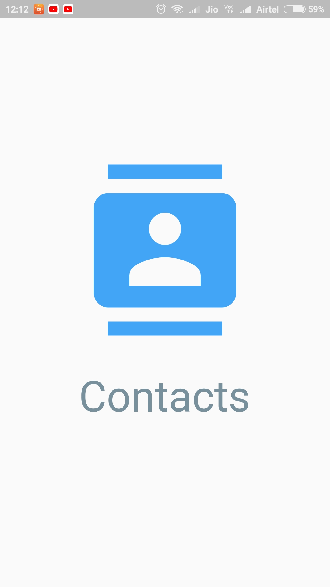
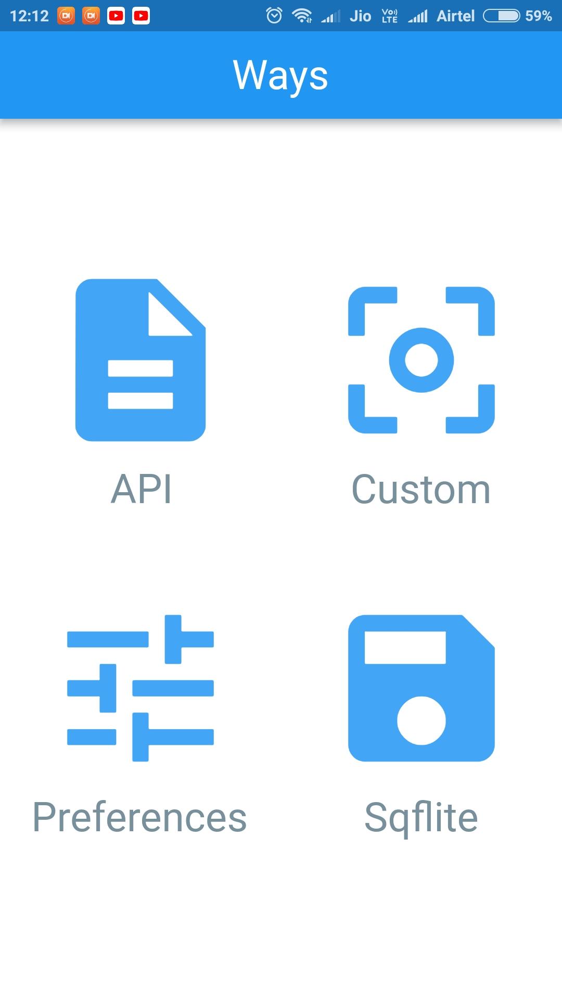
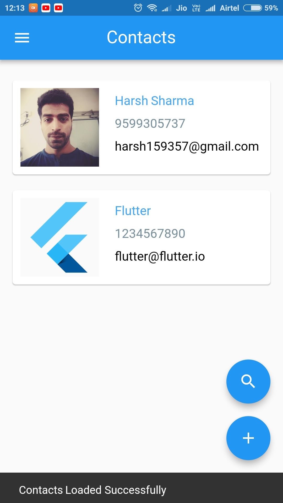

 

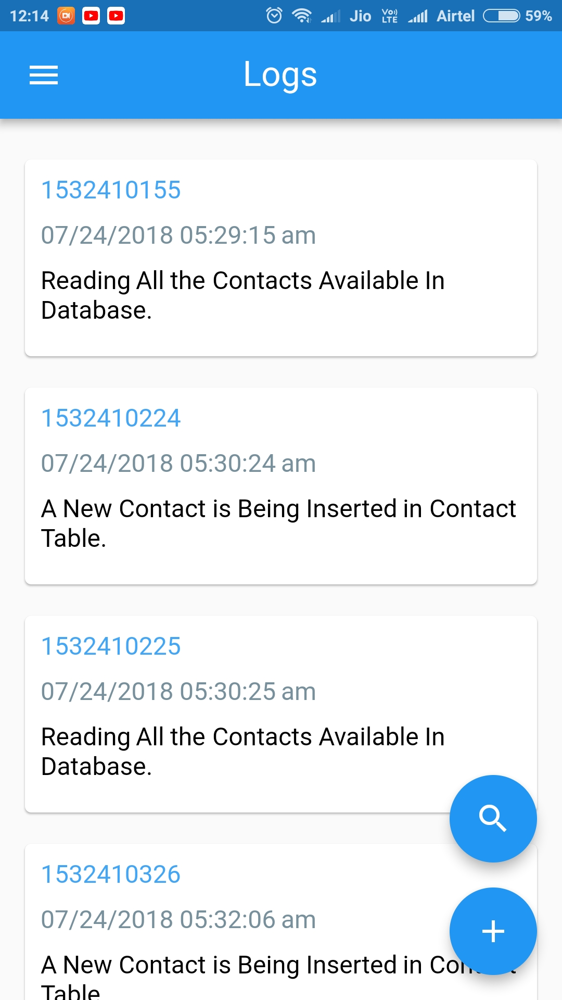
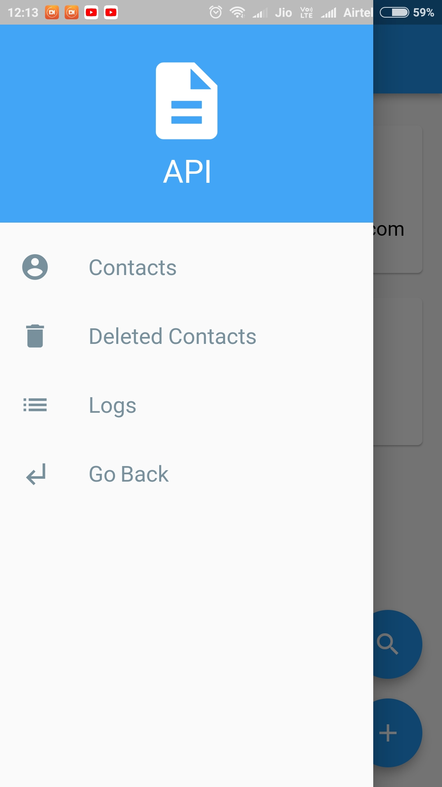

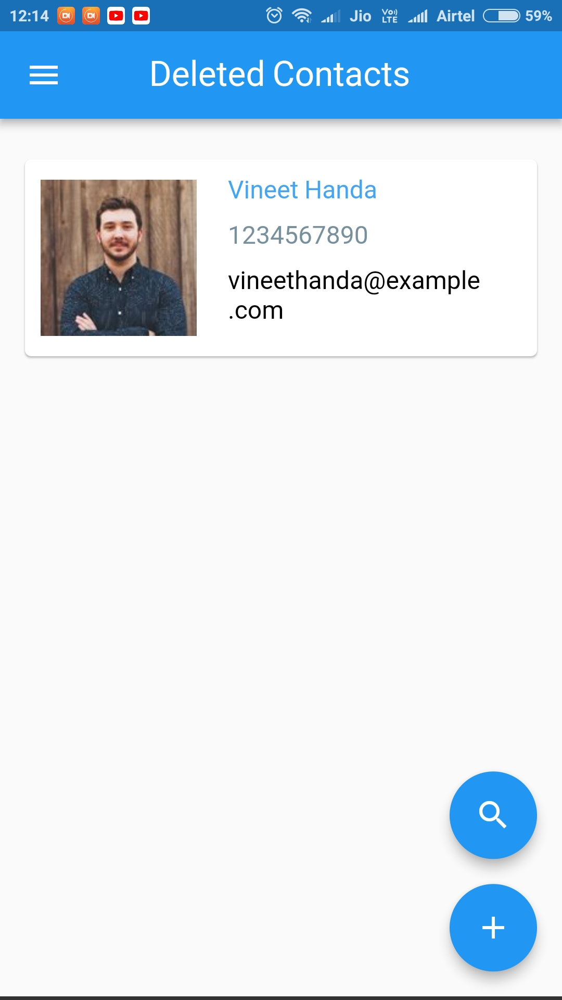

 

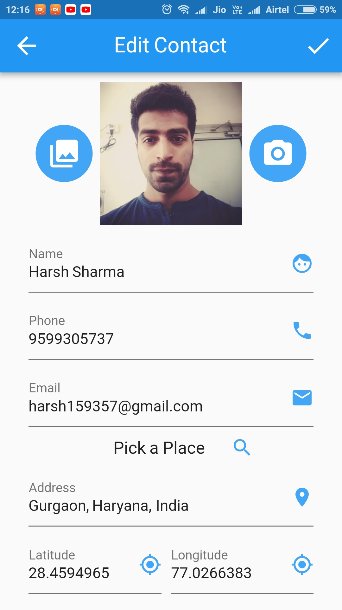
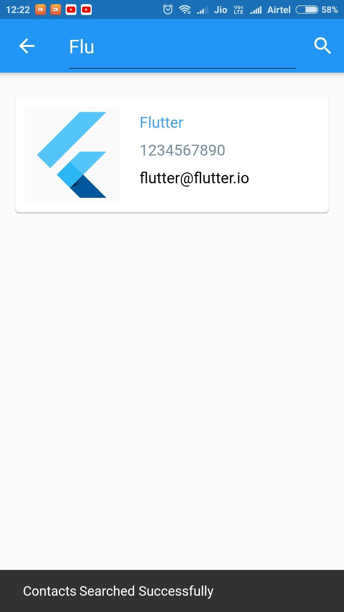
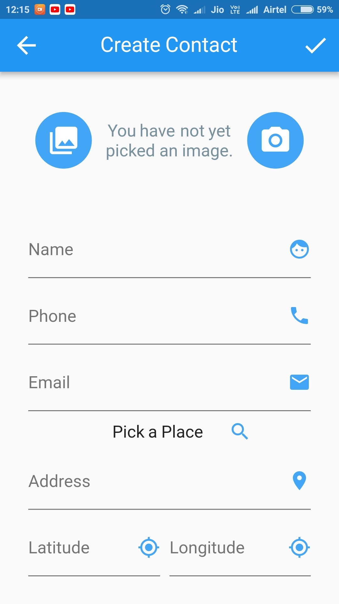
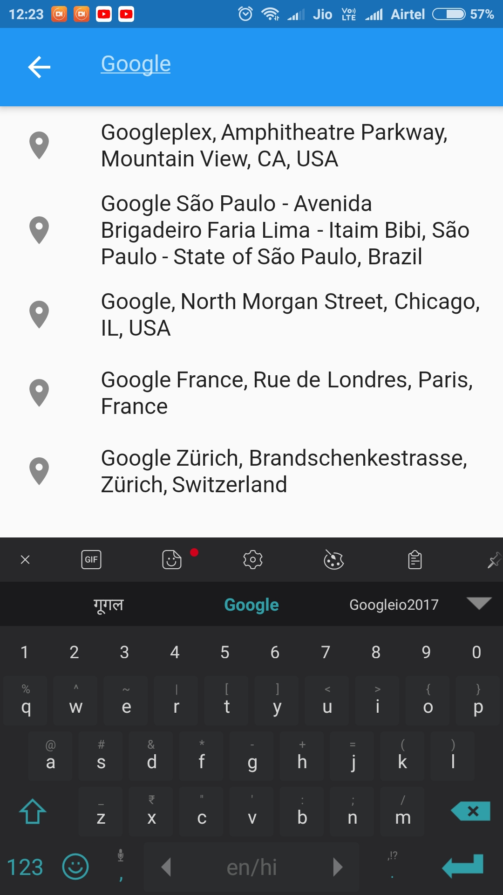

 

## How to use this App.
* Host the sample included inside [phpbackend](https://github.com/harsh159357/contacts/blob/master/phpbackend/) on preferred web hosting
* Create Tables inside your database using [contacts.sql](https://github.com/harsh159357/contacts/blob/master/phpbackend/contacts.sql)
* If you are using your own website with the steps mentioned above edit the following constant inside [constants.dart](https://github.com/harsh159357/contacts/blob/master/lib/utils/constants.dart)

  static const String _CONTACT_API_BASE_URL = "https://bingedev.com/contact/";

* Make sure to edit [DatabaseConnection.php](https://github.com/harsh159357/contacts/blob/master/phpbackend/config/DatabaseConnection.php) and change following things  If you are using the files available in phpbackend-

     private $host = "your_host";
     private $db_name = "your_database_name";
     private $username = "your_user_name";
     private $password = "your_password";
* Make Sure to Use your own Google Place Search API key edit the following constant inside [constants.dart](https://github.com/harsh159357/contacts/blob/master/lib/utils/constants.dart)

  const String GOOGLE_PLACE_API_KEY = "REPLACE_IT_WITH_YOUR_OWN_API_KEY";

### Not Interested in doing above steps just clone this repo and use it as it is already hosted [bingedev](https://bingedev.com/contact/)

## Things you can learn through this project -
1. Hero Animation from a Contact List Item to Contact Detail.
2. Google Place Search.
3. Right Swipe to Edit a Contact and Left Swipe to Delete a Contact.
4. Regular Expressions.
5. Form validations.
6. Multiple Floating Action Button on Single Page.
7. Starting a Page for Result.
8. Conversion from Base64 String to Image and Image to Base64 String.
9. Image Picking from Gallery and Camera.
10. Call Intent Launching from Contact Details.
11. Mail Intent Launching from Contact Details.
12. Map Intent Launching from Contact Details
13. Store and Retrieve values from APIs.
14. Store and Retrieve values from Shared Preference.
15. Store and Retrieve values from SQLite Database.
16. Store and Retrieve values from temporary Objects.
17. Navigation Drawer.
18. Navigation Drawer with Multiple Type Of Views.
19. Navigation Between Pages.
20. Performing Operations in Background Thread.
21. Background Operations Chaining.
22. Integration of Rest APIs.
23. Creation of REST APIs in PHP
24. Serialization and DesSerialization of JSON.
25. ProgressDialogs and SnackBar.
26. Custom Progress Dialog & Custom Views.

## Features Implemented
* App is Working on Android and Ios Platforms.
* App Implemented in 4 Ways For all the Operations Available in the App  
   -> API = Integrate REST APIs Created In PHP [Postman Collection Link for REST APIs](https://www.getpostman.com/collections/73c185782197c548c18a) 
   -> Custom =  Used Classes and Objects 
   -> Preferences = Used Shared Preferences 
   -> Sqflite = Used Sqlite Database 
* Rest APIs in PHP
* Splash
* Navigation Drawer
* Contacts List
* Deleted Contacts List
* Logs
* Create Contact
* Contact Details
* Edit Contact
* Search Contacts
* Floating Action Button
* Hero Animation
* Google Place Search

### My Previous Flutter Project [Click Here](https://github.com/harsh159357/flutter_client_php_backend)

### If you are aware of [Postman](https://www.getpostman.com/) you can use [Postman Collection](https://www.getpostman.com/collections/73c185782197c548c18a) for Rest API used in this repo

## Helping Hands for this project

* https://randomuser.me/ for Contact Avatars used in the project.
* https://flutter.io/
* https://pub.dartlang.org/packages/flutter_google_places/versions/0.1.4+1
* https://pub.dartlang.org/packages/flutter_launcher_icons
* https://pub.dartlang.org/packages/shared_preferences
* https://pub.dartlang.org/packages/http
* https://pub.dartlang.org/packages/json_annotation
* https://pub.dartlang.org/packages/path_provider
* https://pub.dartlang.org/packages/url_launcher
* https://pub.dartlang.org/packages/image_picker
* https://pub.dartlang.org/packages/json_serializable
* https://pub.dartlang.org/packages/sqflite
* https://libraries.io/pub/intl
* https://flutter.io/animations/hero-animations/
* https://flutter.io/cookbook/design/drawer/
* https://flutter.io/json/#creating-model-classes-the-json_serializable-way
* https://flutter.io/json/
* https://flutter.io/cookbook/networking/fetch-data/
* https://flutter.io/cookbook/

### :heart: Found this project useful?
If you found this project useful, then please consider giving it a :star: on Github and sharing it with your friends via social media.

### Last But not Least
There are still some things which are pending in this project make a pull request to improve this project or suggest an idea
to improve this project further by raising issues.

### Project Maintained By

# [Harsh Sharma](http://bit.ly/githarsh)

Android Developer

License
-------

    Copyright 2018 Harsh Sharma

    Licensed under the Apache License, Version 2.0 (the "License");
    you may not use this file except in compliance with the License.
    You may obtain a copy of the License at

       http://www.apache.org/licenses/LICENSE-2.0

    Unless required by applicable law or agreed to in writing, software
    distributed under the License is distributed on an "AS IS" BASIS,
    WITHOUT WARRANTIES OR CONDITIONS OF ANY KIND, either express or implied.
    See the License for the specific language governing permissions and
    limitations under the License.
